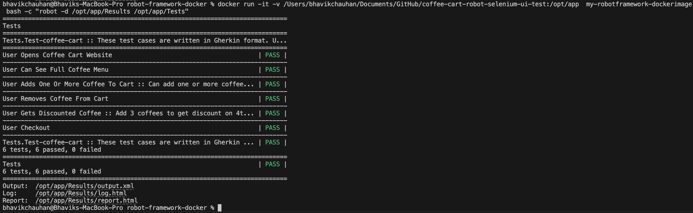

# Robot Framework and Selenium Dockerimage

This project consists of a container image containing a [**Robot Framework**](https://robotframework.org/) installation along with [**Selenium**](https://www.selenium.dev/), Google Chrome and chromedriver.


### Versions
Image is created using offical [**python base image**](https://hub.docker.com/_/python) 3.12

* [**robotframework**](https://github.com/robotframework/robotframework/releases/tag/v7.1) 7.1
* [**robotframework-requests**](https://docs.robotframework.org/docs/different_libraries/requests) 0.9.7
* [**robotframework-jsonlibrary**](https://robotframework-thailand.github.io/robotframework-jsonlibrary/JSONLibrary.html) 0.5
* [**robotframework-datadriver**](https://github.com/Snooz82/robotframework-datadriver) 1.11.0
* [**robotframework-seleniumlibrary**](https://github.com/robotframework/SeleniumLibrary) 6.6.1
* [**Google Chrome**](https://googlechromelabs.github.io/chrome-for-testing/) 131.0.6778.204
* [**Chromedriver**](https://googlechromelabs.github.io/chrome-for-testing/) 131.0.6778.204

### Building the image
```
docker build -t my-robotframework-dockerimage <context / path to docker file> 
```

### Running the container
```
docker run -it -v <path to test robot project>:/opt/app  my-robotframework-dockerimage bash -c "robot -d /opt/app/Results /opt/app/Tests"
```

